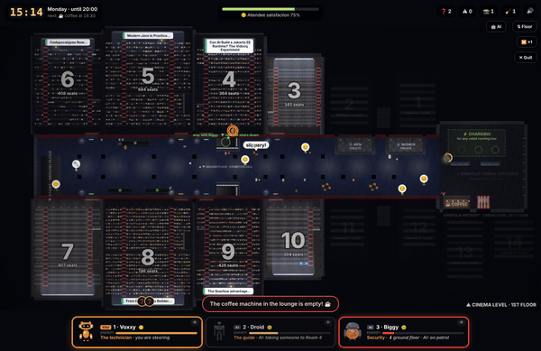
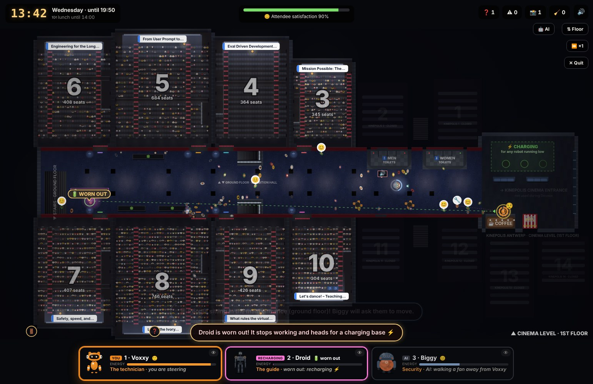

# Overclocked - a Devoxx robot game

> **The robots can do their jobs. They just don't know when to stop. You're the only one who noticed.**



**Overclocked** is a browser game created for [The Robot Games](https://game.devoxx.be), a Devoxx Belgium competition. It takes place over a full Devoxx week, on both floors of the Kinepolis Antwerp.

Voxxy, Droid and Biggy run the conference: they fix breakdowns, guide lost attendees and keep order. They work autonomously, but they never stop on their own. Repairs, escorts, crowds and enthusiastic fans all drain their energy. **Your role is to notice when a robot is running low, stay with it, and send it to recharge**, from Monday to Friday.

> **Improved version.** This repository continues the game after the contest: the real Kinepolis layout, the real talks in their rooms, Biggy's balance, a Quit button, speech bubbles and bug fixes. See [IMPROVED.md](IMPROVED.md), and play it at <https://trinkolin.github.io/overclocked-improved/>. The contest version is unchanged in [Trinkolin/overclocked](https://github.com/Trinkolin/overclocked) and at <https://trinkolin.github.io/overclocked/>.



## Contents

- [Getting started](#getting-started)
- [Controls](#controls)
- [Gameplay](#gameplay)
- [The robots](#the-robots)
- [A realistic Devoxx week](#a-realistic-devoxx-week)
- [The venue and modelling assumptions](#the-venue-and-modelling-assumptions)
- [Privacy](#privacy)
- [Project structure](#project-structure)
- [Tests and tools](#tests-and-tools)
- [Use of generative AI](#use-of-generative-ai)
- [License](#license)

## Getting started

### Play online

<https://trinkolin.github.io/overclocked-improved/> runs in any current browser, on a laptop or a phone. Touch controls appear automatically on touch screens.

### Run locally

The game has no build step and no runtime dependencies: it is plain JavaScript (ES modules) drawn on a `<canvas>`. Browsers do not load ES modules from `file://`, so it must be served over HTTP:

```bash
git clone https://github.com/Trinkolin/overclocked.git
cd overclocked
python3 -m http.server 8080
```

Then open <http://localhost:8080>.

- On Windows, use `python` instead of `python3`.
- With Node.js instead of Python, run `npm start` (it downloads the `serve` package on first use).

The tests and development tools require **Node.js 18 or later**.

## Controls

| Keyboard and mouse | Touch screen | Action |
|---|---|---|
| WASD / ZQSD / arrow keys | Stick | Move the robot you are steering |
| E / Space (hold) | E button (hold) | Fix a breakdown (Voxxy); stay with a tired or worn-out robot. With Droid, a short press asks the attendees following it to wait |
| 1 / 2 / 3, Tab (Shift+Tab: previous), or click a robot or its card | Tap a robot or its card | Switch robot (a worn-out robot cannot be selected until it has recharged) |
| 0 | 🤖 AI button | Let the AI run all three robots; take one back at any time |
| F, Page Up / Page Down, or click a floor on the mini-map | ⇅ Floor button | View the other floor |
| Click 👁 on a card | Tap 👁 on a card | Follow a robot with the camera without steering it |
| T | ⏩ button | Toggle game speed between ×1 and ×2 (the setting persists until changed) |
| P or Esc (R in the pause menu restarts the day) | ⏸ button | Pause |
| M | 🔊 button | Mute |
| N | — | Write a playtest note |

**Menus:** Enter or Space activates the highlighted button, Tab moves between buttons (Enter or Space then activates the selected one), and Esc goes back one step. On the robot selection screen, 1, 2 and 3 choose a robot and 0 hands all three to the AI.

**On-screen cues:**

- Each robot has an energy ring on the map in its own colour (Voxxy orange, Droid gold, Biggy blue), matching the bar on its card. The ring turns red when energy runs low. Hovering over a card makes its robot pulse on the map.
- Game messages appear one at a time, just above the robot cards.
- The guide arrow points to what needs attention: yellow for your robot's own job, green for a robot that needs you. It can be turned off on the rules screen or in the pause menu.
- When the operating system's "reduce motion" setting is enabled, the screen does not shake and no confetti is shown.

## Gameplay

### Objective

Get through each day with the attendees' satisfaction above zero, while keeping the three robots from wearing themselves out.

### Rules

- **The robots work on their own.** The game's AI performs their jobs. You can steer any of them, but your real task is looking after them: robots controlled by the AI never take care of each other.
- **Work drains energy.** Long repairs, long escorts, security checks, crowds and fans all cost energy.
- **Stay with a tired robot.** Bring the robot you are steering next to it and hold E. The tired robot stops where it is and recovers energy, up to 100% (a Voxxy already busy with a repair keeps repairing meanwhile). Biggy is the most reassuring companion. When Voxxy is next to a breakdown, it fixes the breakdown first, unless the other robot is below 75%.
- **Give it a break.** A robot parked against a standing table recovers some energy. The robots never do this on their own.
- **Small bonuses.** Stopping at a working coffee machine grants an ☕ espresso boost (a few seconds of extra speed), and a second robot next to Voxxy speeds up its repair (teamwork).
- **Worn-out robots.** A robot whose energy reaches zero stops working and slowly heads for a ⚡ charging base (in the lounge upstairs, or in a corner of reception downstairs). It only recharges once it is plugged in, or while you stay next to it. Its job is left waiting and satisfaction drops in the meantime.

### A day

- Each day runs from 09:00 to the end of the last session, compressed into three minutes of play (100 seconds on Friday).
- Breakdowns, lost attendees and worn-out robots reduce satisfaction. A breakdown in a room with no talk in progress costs less, and nobody complains about it until the next talk starts.
- The day ends early if satisfaction reaches zero, or if all three robots are worn out at the same time.

### Scoring

Each day awards up to three stars, one per objective:

| Star | Objective |
|---|---|
| ★ | Reach closing time |
| ★ | No robot wears out |
| ★ | Attendee satisfaction is at least 75% at the end of the day |

The results screen shows which objectives were met. Winning a day unlocks the next one, and after Friday a dedicated screen summarises the whole week.

## The robots

| Robot | Traits (from the model sheets) | Role | Drained by |
|---|---|---|---|
| **Voxxy** | Light, quick, "built to move" | **Technician.** Fixes projectors, Wi-Fi, microphones, coffee machines, the badge printer, booth power, toilets and the popcorn machine, on both floors. Most repairs are quick; some are stubborn. | Long repairs, fans 📸🔧, crowds |
| **Droid** | Tall, deliberate, knows the building | **Guide.** Lost attendees ❓ follow it to the door of their room (up to three at a time), at a pace they can keep up with, and go in from there. | Long escorts, fans 📸🔧, crowds |
| **Biggy** | Heavy, slow to start, hard to stop | **Security.** Checks unattended bags 🎒, clears people sitting on the stairs 🚪, and calms fans who get carried away 🤩 or keep following a busy robot. Bags and stairs take priority. Fans who stay next to Biggy for a moment go home. The AI drives Biggy gently and never pushes anyone; a player who drives it fast into a crowd bumps people, which costs satisfaction. | Security checks, patrols, fans 📸🔧, crowds |

Small cleaning robots (not playable) mop up spilled coffee, soda and popcorn.

**The visitors are friendly.** Nobody is hostile to the robots: fans take three selfies and leave, curious attendees press a few buttons and move on, and unhappy attendees complain out loud but never chase a robot. Occasionally a fan gets carried away ("just one more!") and calls a friend over. Biggy keeps things friendly; left alone, these fans lose interest after about thirty seconds.

## A realistic Devoxx week

The five days follow the Devoxx Belgium 2026 schedule:

| Day | Format | Characteristics |
|---|---|---|
| **Monday** | Deep Dive | Three-hour sessions; one of the calmest days. Exhibitors set up in the morning and open their booths at 14:00. The polo pickup is open from the start of the day. |
| **Tuesday** | Deep Dive | Three-hour sessions; calm. |
| **Wednesday** | Conference | The busiest day. The opening keynote fills Room 8 until 11:30, then the whole room comes out for coffee. |
| **Thursday** | Conference | Slightly calmer than Wednesday. Exhibitors pack up in the afternoon, and everyone heads to Room 8 for the closing keynote. |
| **Friday** | Conference | A calm half day ending at 12:40, in five rooms, without exhibitors. It is the most forgiving day: a player who never moves their robot can still earn one or two stars, whereas every other day is lost that way. |

**First-day behaviour.** Attendees get lost mostly on their first day: Monday for the Deep Dive and Wednesday for the conference. These are also the days when they want selfies with the robots and press their buttons. On Tuesday, Thursday and Friday, half as many attendees get lost and there are half as many fans.

**Breaks.** During a talk, most attendees are in the rooms and the corridors are quiet. About one in ten skips the talk: at a standing table or the lounge coffee upstairs; at the booths, the polo pickup or the hall coffee downstairs; or on the wide stairs at reception, where a few early arrivals are already chatting when the doors open. At lunch and coffee breaks everyone comes out at once, and about a third head for the toilets first (arriving slightly late for the next talk). The next break is shown under the clock, and the game warns you shortly before the major ones.

**Talks.** Each room's screen shows the talk currently in progress, taken from the public schedule (titles only, no speaker names). The first words of the title appear on a white card in the colour of its session type, as on the Devoxx schedule; the full title is shown while the robot you steer is in the room. As at Devoxx, the house lights dim during a talk, leaving only the screen and the red step LEDs lit, and come back up between talks. The public schedule does not yet assign rooms, so the game assigns talks to rooms itself.

## The venue and modelling assumptions

The two Kinepolis floor plans from the Devoxx references are stacked: reception and the exhibition hall on the ground floor, the auditoriums on the first floor. Details come from photos of the rooms and from the Kinepolis Antwerp virtual tour.

- **Reception.** The wide stairs rise straight ahead from the main entrance, with the reception desk beneath them. A charging base sits in a corner, out of the way.
- **Exhibition hall** (the Kinepolis "Hollywood" hall). Twelve sponsor booths along aisles, white pillars, the hall coffee station, two short flights of stairs up to the rooms, and the polo pickup, a long white counter open from the morning.
- **First floor.** A long corridor serving rooms 3 to 10, with dark pillars under white fabric sails down the middle, standing tables, and two stairwells down to the hall along its walls (between rooms 3 and 4, and between rooms 9 and 10). At the far end, the Kinepolis lounge: a charging corner, the coffee and popcorn machines, and two sofas facing them.

The mini-map in the top-left corner shows both floors, every robot and every breakdown. The Devoxx site's example prompt mentions a grand staircase leading to a foyer; on the Devoxx plan that entrance hall is not used during the conference, so the game omits it.

Where the plans do not specify heights, materials or dimensions, the following assumptions apply:

| Topic | Assumption |
|---|---|
| **Scale** | 1 map unit ≈ 7 cm. The navigation grid cell (70 cm) is about one person wide. Both plans share the same rotation, so the main corridor runs left to right. |
| **Rooms** | Widths follow the plan; depths are reduced to about 60% so that each floor fits on one screen. Seat counts come from the plan (Room 8: 746 … Room 10: 304) and determine how many attendees each talk draws. Kinepolis rooms 1, 2 and 11–14 are closed. |
| **Seating and doors** | Stadium seating as in the photos: three blocks of seats from the side walls to the projection room, with a cross aisle halfway. Each room has a single set of double doors (2.8 m) at one end of its wall, matching Kinepolis. The entrance passes under the back rows, so attendees only become visible once they reach the cross aisle. Voxxy fixes a room's breakdowns in its projection room, along the back wall. The service corridors behind the rooms are staff-only: robots can use them, attendees cannot. |
| **Sizes** | Voxxy Ø 0.85 m, Droid Ø 0.9 m, Biggy Ø 1.3 m: about 30% larger than the real robots (Ø 0.65, 0.7 and 1 m) so that they stand out in the crowd. Attendees Ø 0.55–0.75 m; cleaning robots Ø 0.55 m. |
| **Stairs** | About 6 m between floors (34 steps). Stairs are real flights: people and robots climb every step and change floors at the top one. A railing surrounds each staircase, so it can only be entered from its end. The hall stairs are placed where the exhibition plan shows them, not exactly beneath their upstairs landings, because the two plans share no reference point. The wheelchair ramp is drawn; the lift is not modelled. |
| **Toilets** | Four blocks, from the plans. Upstairs, the men's kiosk is under Kinepolis room 2 and the women's under room 1; downstairs, each block has both. Attendees are not visually distinguished, but each uses the appropriate toilets; about 85% are men, as at Devoxx. Each side has a few stalls; when all are occupied, a queue forms along the wall outside. |
| **Materials** | Visual only: navy carpet in the corridor, red walls in the rooms, beige-brown carpet and white walls in the hall, stone at reception. Pillars, tables, sofas and counters are physical obstacles; only spills change how a floor behaves. |
| **Time and crowd** | A day lasts 3 minutes (100 s on Friday) while everyone moves in real time; ⏩ (T) doubles the pace. The map shows from about 15 attendees (during a talk on a calm day) to about 110 (at a break on Wednesday): a sample of the ~3,500 Devoxx attendees. |
| **Speeds** | Attendees walk at 1.5–2.2 m/s. Robots are deliberately faster than the real ones (Voxxy 7.7 m/s, Droid 5 m/s, Biggy 5.6 m/s) so that they can cover two floors in a three-minute day. Each robot's top speed is the `max` value in `src/robots.js`, in map units per second (multiply by 0.07 for m/s). |

## Privacy

Progress is stored locally in the browser's `localStorage`: unlocked days, stars and scores, and two settings (the guide arrow and the starting robot). It is therefore specific to one browser on one device; another browser, a private window or cleared site data starts again from Monday. The **Reset progress** link on the title screen clears your progress (the two settings are kept).

The game has no account, no cookies and no analytics, and sends no data anywhere. The hosting provider, GitHub Pages, logs visitors' IP addresses for security purposes, as any web server does.

## Project structure

```
index.html, style.css   Page layout, menus and HUD
src/main.js             Menus, input (keyboard and touch), HUD, results and week screens
src/game.js             Simulation: robot jobs, energy, charging, security, schedule, satisfaction, stars
src/crowd.js            Attendees: walkers, lost attendees, fans, friendly attendees
src/level.js            Both floors of the Kinepolis, derived from the floor plans
src/nav.js              Flow fields (Dijkstra) used by the crowd and the robots for pathfinding
src/physics.js          Movement against walls, collisions, stepping around door jambs
src/robots.js           Robot physics and procedural drawing based on the model sheets
src/render.js           Building, lighting, signs, speech bubbles and markers
src/audio.js            All sound effects, synthesised with the Web Audio API
src/lines.js            Attendee and robot dialogue
src/talks.js            Devoxx Belgium 2026 talk titles, per day
tools/                  Tests, scripted players and the talk-title updater (see below)
docs/                   Screenshot and GIF used in this README
```

**Legacy internal names.** Some identifiers predate the final theme: `patience` stores a robot's energy, `rogue` means worn out, and the `keepcalm.` storage keys come from the earlier working title *Keep Calm, Robots* (see [GENAI.md](GENAI.md)). They were kept to avoid a risky rename close to the deadline and to preserve players' saved progress.

## Tests and tools

```bash
npm test                          # 64 scripted checks covering every robot action and rule (about 30 s)
node tools/player-bot.mjs 16      # an attentive scripted player over 16 seeded days (DAY=0..4 selects the day)
node tools/sim.mjs 3              # an idle player who steers Voxxy and never touches the controls (seed 3)
node tools/sim.mjs 3 ai           # the AI runs all three robots with no player input
node tools/stress.mjs 3           # full days with random input
node tools/talks.mjs              # refresh the talk titles from the public schedule API
python tools/serve.py             # a playtest server that disables browser caching
```

During play, **N** records a playtest note. The results screen can export the day's log (JSON) and a transcript of all dialogue; the pause menu can export the transcript.

## Use of generative AI

Overclocked was built with **Claude (Opus 5.5) in Claude Code**, with **Google Gemini** used for a second opinion and a few game-feel features. [GENAI.md](GENAI.md) documents the working method, the design decisions and who made them, and how the result was verified.

## License

Released under the [MIT License](LICENSE).

The robot designs and venue plans are the property of Devoxx and are used as intended by the competition. Talk titles are taken from the public Devoxx Belgium 2026 schedule.
